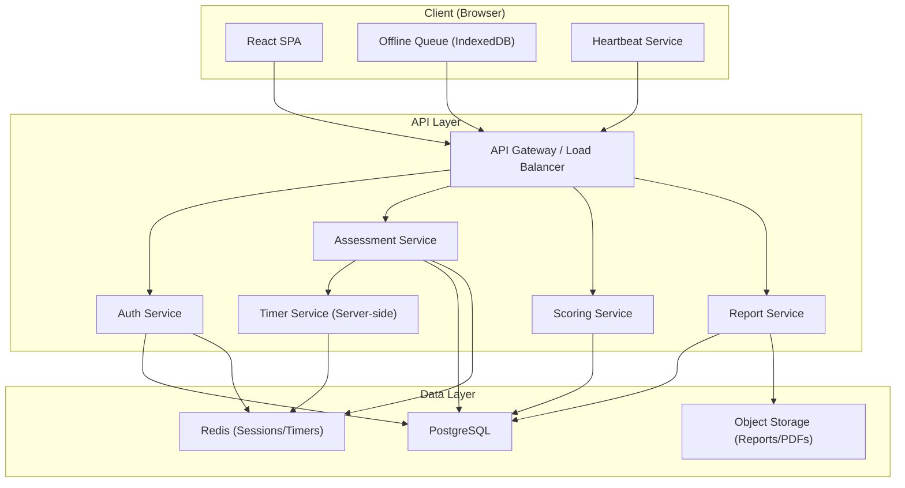
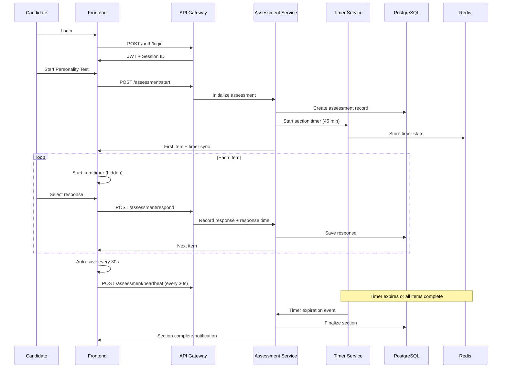
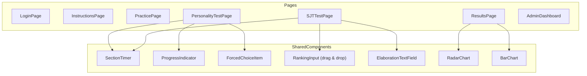
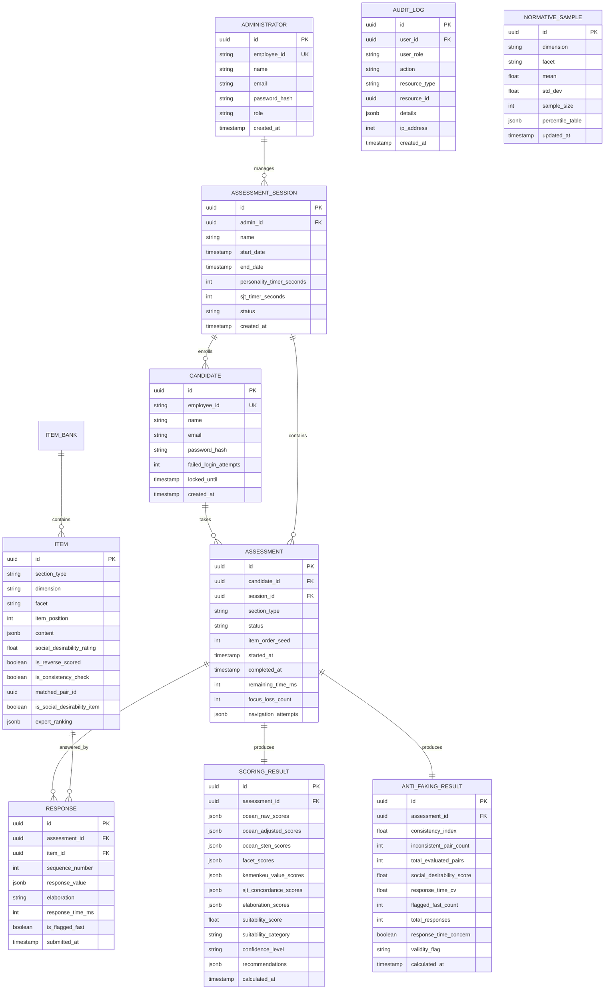

# Design Document: Personality & SJT Assessment Platform

## Overview

This document describes the technical design for a web-based psychological assessment platform for the MINTS scholarship selection at Kementerian Keuangan. The platform administers two assessments:

1. **Personality Test** — Forced-choice (Graded Paired Comparisons) measuring Big Five (OCEAN) traits
2. **Situational Judgement Test (SJT)** — Most effective/least effective ranking of workplace scenarios

The system incorporates anti-faking mechanisms (response time tracking, consistency index, social desirability detection), maps results to Kemenkeu's five core values, and generates comprehensive reports for administrators.

### Key Design Decisions

| Decision | Choice | Rationale |
|----------|--------|-----------|
| Architecture | Monolithic backend with SPA frontend | Simpler deployment for a bounded-scope assessment tool; can be decomposed later |
| Backend | Node.js (TypeScript) with Express/Fastify | Strong typing, good ecosystem for real-time features, JSON-native |
| Frontend | React with TypeScript | Component-based UI, strong ecosystem for forms and timers |
| Database | PostgreSQL | ACID compliance for assessment data integrity, JSON support for flexible item storage |
| Scoring | Server-side computation | Security-critical calculations must not run client-side |
| Authentication | JWT with refresh tokens | Stateless auth suitable for session resumption |
| PDF Generation | Puppeteer/Playwright headless rendering | High-fidelity PDF from the same React report components |

## Architecture

### High-Level Architecture



### Component Responsibilities

| Component | Responsibility |
|-----------|---------------|
| **Auth Service** | Login, JWT issuance/refresh, account lockout, RBAC |
| **Assessment Service** | Item delivery, response recording, randomization, auto-save, session management |
| **Timer Service** | Server-side countdown, time synchronization, expiration events |
| **Scoring Service** | IRT scoring, concordance scoring, anti-faking calculations, composite scores |
| **Report Service** | Report generation (web + PDF), chart rendering, export |
| **Admin Dashboard** | Session management, analytics, candidate monitoring |

### Sequence Diagram: Assessment Flow



## Components and Interfaces

### API Endpoints

#### Authentication

| Method | Endpoint | Description |
|--------|----------|-------------|
| POST | `/api/auth/login` | Authenticate candidate/admin |
| POST | `/api/auth/refresh` | Refresh JWT token |
| POST | `/api/auth/logout` | Invalidate session |

#### Assessment

| Method | Endpoint | Description |
|--------|----------|-------------|
| POST | `/api/assessment/start` | Start assessment section |
| GET | `/api/assessment/current-item` | Get current item for candidate |
| POST | `/api/assessment/respond` | Submit response with timing data |
| POST | `/api/assessment/heartbeat` | Client heartbeat for session monitoring |
| POST | `/api/assessment/auto-save` | Batch save queued responses |
| GET | `/api/assessment/status` | Get assessment progress/status |
| POST | `/api/assessment/resume` | Resume interrupted session |

#### Scoring

| Method | Endpoint | Description |
|--------|----------|-------------|
| POST | `/api/scoring/calculate` | Trigger scoring for completed assessment |
| GET | `/api/scoring/results/:candidateId` | Get scoring results |

#### Reports

| Method | Endpoint | Description |
|--------|----------|-------------|
| GET | `/api/reports/:candidateId` | Get web report |
| GET | `/api/reports/:candidateId/pdf` | Download PDF report |
| GET | `/api/reports/session/:sessionId/export` | Export session results (CSV/Excel) |

#### Admin

| Method | Endpoint | Description |
|--------|----------|-------------|
| POST | `/api/admin/sessions` | Create assessment session |
| GET | `/api/admin/sessions` | List sessions |
| GET | `/api/admin/sessions/:id/analytics` | Get session analytics |
| GET | `/api/admin/sessions/:id/candidates` | Get candidate progress |
| GET | `/api/admin/audit-log` | View audit log |

### Frontend Components



### Key Interface Contracts

```typescript
// Response submission payload
interface ResponsePayload {
  assessmentId: string;
  itemId: string;
  response: number | number[]; // scale value or ranking array
  elaboration?: string;
  responseTimeMs: number;
  clientTimestamp: number;
}

// Timer sync response
interface TimerSync {
  sectionId: string;
  remainingMs: number;
  serverTimestamp: number;
}

// Scoring result
interface ScoringResult {
  candidateId: string;
  personality: {
    dimensions: OCEANScore[];
    facets: FacetScore[];
    rawScores: OCEANScore[];
    adjustedScores: OCEANScore[];
  };
  sjt: {
    valueScores: KemenkeuValueScore[];
    elaborationScores: ElaborationScore[];
  };
  composite: {
    suitabilityScore: number;
    category: SuitabilityCategory;
    confidence: ConfidenceLevel;
  };
  antiFaking: {
    consistencyIndex: number;
    socialDesirabilityScore: number;
    responseTimeConcern: boolean;
    flaggedResponseCount: number;
    totalResponses: number;
    focusLossCount: number;
  };
}

type SuitabilityCategory = 'Highly Suitable' | 'Suitable' | 'Conditionally Suitable' | 'Not Suitable';
type ConfidenceLevel = 'High Confidence' | 'Moderate Confidence' | 'Low Confidence';
```

## Data Models

### Entity Relationship Diagram



### Key Schema Details

**Item Content (JSONB)**

For Personality Test items:
```json
{
  "type": "forced_choice",
  "statement_left": "Saya senang mencoba hal-hal baru",
  "statement_right": "Saya lebih suka rutinitas yang sudah terbukti",
  "dimension_left": "openness",
  "dimension_right": "conscientiousness",
  "facet_left": "openness_to_experience",
  "facet_right": "orderliness",
  "social_desirability_left": 3.5,
  "social_desirability_right": 3.2
}
```

For SJT items:
```json
{
  "type": "sjt_scenario",
  "scenario_text": "Anda menemukan rekan kerja...",
  "word_count": 150,
  "kemenkeu_value": "integritas",
  "options": [
    { "id": "a", "text": "Melaporkan langsung...", "expert_rank": 1 },
    { "id": "b", "text": "Berbicara dengan rekan...", "expert_rank": 2 },
    { "id": "c", "text": "Mengabaikan situasi...", "expert_rank": 4 },
    { "id": "d", "text": "Mendiskusikan dengan tim...", "expert_rank": 3 }
  ]
}
```

## Correctness Properties

*A property is a characteristic or behavior that should hold true across all valid executions of a system — essentially, a formal statement about what the system should do. Properties serve as the bridge between human-readable specifications and machine-verifiable correctness guarantees.*

### Property 1: Test Assembly Invariants

*For any* valid item bank and randomization seed, the assembled Personality Test SHALL satisfy all of the following simultaneously:
- Total item count is between 120 and 180
- Each OCEAN dimension has at least 24 items
- Each OCEAN dimension appears 10–14 times per test half
- Consistency-check item pairs are placed at least 20 positions apart
- Social desirability items (10 total) are placed at least 5 positions apart
- Reverse-scored items comprise at least 30% of total items

**Validates: Requirements 2.2, 2.3, 2.5, 2.7, 7.1, 15.5**

### Property 2: Social Desirability Matching Constraint

*For any* forced-choice item pair presented to a candidate, the absolute difference between the social desirability ratings of the two statements SHALL be at most 1.0 on the 5-point scale.

**Validates: Requirements 2.1**

### Property 3: Consistency Index Calculation

*For any* set of candidate responses to matched item pairs (where some pairs may have unanswered items), the Consistency Index SHALL equal (number of pairs where |response1 - response2| ≤ 2) divided by (total pairs excluding those with unanswered items) × 100, and the assessment SHALL be flagged as "significant inconsistency" if and only if this index falls below 60%.

**Validates: Requirements 6.1, 6.2, 6.3, 6.4, 6.6**

### Property 4: Response Time Flagging

*For any* candidate response, the response SHALL be flagged as potentially invalid if and only if: the response time is less than 1500ms for Personality Test items, or less than 8000ms for SJT items. Furthermore, responses with time exceeding 300000ms SHALL be excluded from the response time coefficient of variation calculation.

**Validates: Requirements 5.3, 5.4, 5.5**

### Property 5: Response Time Concern Threshold

*For any* candidate's complete set of responses, the assessment SHALL be marked with "response time concern" if and only if the count of flagged responses divided by total responses exceeds 0.20 (20%).

**Validates: Requirements 5.7**

### Property 6: Coefficient of Variation Calculation

*For any* set of non-excluded response times (those ≤ 300000ms) of the same item type, the response time consistency metric SHALL equal the standard deviation divided by the mean of those response times.

**Validates: Requirements 5.6**

### Property 7: Social Desirability Score and Adjustment

*For any* set of candidate responses to the 10 social desirability items, the SD score SHALL equal the count of keyed (socially desirable) responses selected. When this score is applied as a covariate to adjust personality scores, the adjusted score for any trait SHALL differ from the raw score by at most 1 standard deviation.

**Validates: Requirements 7.2, 7.4**

### Property 8: Social Desirability Flagging

*For any* candidate's social desirability score and a normative percentile table, the assessment SHALL be flagged with "impression management concern" if and only if the score exceeds the 90th percentile value from the normative sample.

**Validates: Requirements 7.3**

### Property 9: Sten Score Normalization

*For any* raw OCEAN dimension or facet score and a normative sample (mean, standard deviation), the resulting sten score SHALL be an integer in the range 1–10, correctly mapped using the standard sten formula: sten = round(2 × z-score + 5.5), clamped to [1, 10].

**Validates: Requirements 8.2, 8.3**

### Property 10: OCEAN to Kemenkeu Values Mapping

*For any* set of five OCEAN sten scores, the Kemenkeu value alignment scores SHALL be calculated by averaging the contributing dimension sten scores according to the defined mapping: Integritas = avg(reverse(Neuroticism)), Profesionalisme = avg(Conscientiousness, reverse(Neuroticism)), Sinergi = avg(Agreeableness, Extraversion), Pelayanan = avg(Agreeableness, Extraversion), Kesempurnaan = avg(Conscientiousness, Openness).

**Validates: Requirements 8.5, 8.7**

### Property 11: SJT Concordance Scoring

*For any* candidate ranking and expert ranking of response options, the concordance score SHALL be calculated by comparing position matches with 2× weight for the most effective and least effective positions and 1× weight for middle positions, producing a per-value score normalized to the 0–100 scale.

**Validates: Requirements 9.1, 9.2, 9.3**

### Property 12: Composite Suitability Score

*For any* personality-value alignment sub-score (normalized 0–100) and SJT-value alignment sub-score (normalized 0–100), the composite Suitability Score SHALL equal 0.4 × personality_sub_score + 0.6 × sjt_sub_score, and the result SHALL be in the range 0–100.

**Validates: Requirements 10.1**

### Property 13: Suitability Category Classification

*For any* Suitability Score in the range 0–100, the candidate SHALL be classified into exactly one category: "Highly Suitable" if score ≥ 80, "Suitable" if 60 ≤ score < 80, "Conditionally Suitable" if 40 ≤ score < 60, or "Not Suitable" if score < 40.

**Validates: Requirements 10.2**

### Property 14: Confidence Qualifier and Validity Warning

*For any* combination of flagged response percentage and inconsistency flag count, the confidence level SHALL be: "High Confidence" if 0% flagged AND 0 inconsistency flags, "Moderate Confidence" if 1–29% flagged OR 1–2 inconsistency flags, "Low Confidence" if ≥ 30% flagged OR ≥ 3 inconsistency flags. A validity warning SHALL be appended if and only if ≥ 3 inconsistency flags OR > 30% flagged responses.

**Validates: Requirements 10.4, 10.5**

### Property 15: Timer Integrity During Disconnection

*For any* assessment session with a server-side timer, if the client disconnects for duration D, the server timer SHALL continue decrementing. Upon reconnection, the remaining time SHALL equal (original_remaining_at_disconnect - D). When a candidate resumes an interrupted session, the remaining assessment time SHALL be reduced only by the elapsed time between session start and the moment of interruption (disconnection time SHALL NOT be deducted from assessment time).

**Validates: Requirements 1.6, 4.7**

### Property 16: Session Lockout Threshold

*For any* sequence of login attempts for a candidate account, the account SHALL be locked if and only if there are 3 or more consecutive failed attempts without an intervening successful attempt.

**Validates: Requirements 1.2**

### Property 17: Response Preservation on Interruption

*For any* set of responses submitted before a session interruption, all responses that were successfully saved (up to the last auto-save or explicit save) SHALL be retrievable after the interruption, regardless of when the candidate resumes.

**Validates: Requirements 1.5**

### Property 18: SJT Ranking Validation

*For any* submitted SJT ranking for a scenario with N options, the ranking SHALL be accepted if and only if it is a valid permutation of [1..N] (no ties, no gaps, no duplicates) AND the elaboration text length is between 50 and 500 characters inclusive.

**Validates: Requirements 3.3, 3.4**

### Property 19: Session Configuration Validation

*For any* assessment session configuration, the system SHALL reject the configuration if and only if end_date ≤ start_date OR the candidate list is empty.

**Validates: Requirements 12.7**

### Property 20: Offline Queue Synchronization

*For any* set of responses queued locally during a connection interruption, upon connection restoration all queued responses SHALL be synchronized to the server, and the server state SHALL contain every response that was in the local queue.

**Validates: Requirements 16.6**

## Error Handling

### Error Categories and Strategies

| Category | Strategy | User Impact |
|----------|----------|-------------|
| **Authentication Failure** | Return specific error codes, increment lockout counter | Clear message with remaining attempts |
| **Session Interruption** | Preserve state in Redis + DB, allow 30-min resume | Transparent resume from last saved point |
| **Timer Expiration** | Server-side enforcement, auto-submit | Notification + all saved responses submitted |
| **Scoring Failure** | Partial scoring with clear indicators | Report shows available sections + missing data notices |
| **Network Loss** | Client-side queue (IndexedDB), heartbeat detection | Auto-retry on reconnect, no data loss |
| **Validation Error** | Reject with specific field-level messages | Inline error messages in Bahasa Indonesia |
| **Server Error** | Log, alert admin, graceful degradation | Generic error page with retry option |

### Retry and Recovery Patterns

```typescript
// Client-side retry with exponential backoff
interface RetryConfig {
  maxRetries: 3;
  baseDelayMs: 1000;
  maxDelayMs: 30000;
  backoffMultiplier: 2;
}

// Offline queue structure
interface QueuedResponse {
  id: string;
  payload: ResponsePayload;
  timestamp: number;
  retryCount: number;
  status: 'pending' | 'syncing' | 'failed';
}
```

### Critical Error Scenarios

1. **Mid-assessment server crash**: Redis stores timer state; DB stores all committed responses. On recovery, candidate resumes from last saved item with correct timer.
2. **Scoring engine timeout**: Background job with 30-second timeout. If exceeded, mark as "scoring pending" and retry. Admin notified after 3 failures.
3. **Database connection loss**: Connection pooling with health checks. Read replicas for report generation. Write operations queued in application memory (bounded buffer) for up to 60 seconds.

## Testing Strategy

### Testing Pyramid

```
         ┌─────────────┐
         │   E2E (10%) │  Full assessment flow, PDF generation
         ├─────────────┤
         │ Integration │  API endpoints, DB queries, timer sync
         │    (30%)    │
         ├─────────────┤
         │    Unit +   │  Scoring algorithms, anti-faking,
         │  Property   │  validation, assembly, normalization
         │    (60%)    │
         └─────────────┘
```

### Property-Based Testing Configuration

- **Library**: [fast-check](https://github.com/dubzzz/fast-check) (TypeScript)
- **Minimum iterations**: 100 per property test
- **Tag format**: `Feature: personality-sjt-assessment, Property {N}: {title}`

Each correctness property (1–20) maps to a dedicated property-based test that generates random inputs and verifies the universal property holds.

### Unit Testing Focus

- Specific scoring examples with known expected outputs
- Edge cases: empty responses, single item, maximum items
- Error conditions: invalid input formats, missing data
- Integration points: API request/response contracts

### Integration Testing Focus

- Full API endpoint testing with database
- Timer synchronization across client/server
- Session interruption and resume flow
- Report generation (web + PDF)
- Cross-browser compatibility (Playwright)

### E2E Testing Focus

- Complete candidate assessment flow (login → personality → SJT → results)
- Administrator session management and report viewing
- Network interruption simulation
- Timer expiration scenarios

